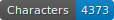
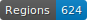
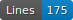
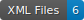

# Projet Frene
Projet de transcription automatique ATR d'un journal Manuscrit du Pasteur Théophile Remy Frene, effectué dans le cadre de mon mémoire de Master en Patrimoine régional et Humanités numériques à l'Université de Neuchâtel.

    

## Données 
Les données se trouvent au chemin "./data/."
Elles sont au format alto (v.4) et suivent les normes de segmentation SegmOnto (https://segmonto.github.io).

## Infrastructure

## Remerciement

Pour la réutilisation des sciptes du projet selon le respect des droits de leurs Github : https://github.com/Gallicorpora/HTR-imprime-18e-siecle/tree/main 

*Gallic(orpor)a: extraction, annotation et diffusion de l'information textuelle et visuelle en diachronie longue*, Benoît Sagot, Laurent Romary, Rachel Bawden, Pedro Javier Ortiz Suárez, Simon Gabay, Ariane Pinche, and Jean-Baptiste Camps.
