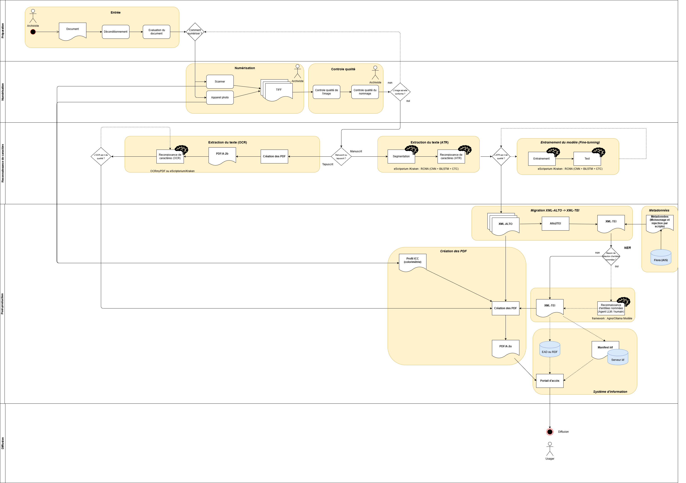

# Projet Frene
Projet de transcription automatique ATR d'un journal Manuscrit du Pasteur Théophile Remy Frene, effectué dans le cadre de mon mémoire de Master en Patrimoine régional et Humanités numériques à l'Université de Neuchâtel.

## Présentation

Projet Frêne est un proof of concept consacré à la numérisation, à la transcription automatique, à la structuration et à la diffusion numérique d'un corpus archivistique.

Il a été développé dans le cadre d'un mémoire de Master en Patrimoine régional et Humanités numériques à l'Université de Neuchâtel, consacré aux évolutions numériques de la diffusion en archives.

Le corpus utilisé est constitué du journal manuscrit du pasteur Théophile-Rémy Frêne (1727–1804), conservé à l'Office des archives de l'État de Neuchâtel (OAEN).

Le projet expérimente la mise en place d'une chaîne de traitement reproductible reposant autant que possible sur des logiciels libres, des standards ouverts et des formats interopérables ainsi que des livrables et infrastructures provenant d'autres projet en Humantiés numériques.

L'objectif n'est donc pas uniquement de produire une transcription du manuscrit, mais d'expérimenter un workflow permettant de passer du document numérisé à plusieurs objets ou dérivées numériques exploitables pour les usages de la recherche et la diffusion des archives.

## Objectifs

Le projet vise notamment à expérimenter :

- la transcription automatique de documents manuscrits par HTR (*Handwritten Text Recognition*) ;
- le *fine-tuning* d’un modèle d’apprentissage automatique ;
- la structuration des résultats de transcription ;
- l’utilisation du format ALTO XML comme format intermédiaire ;
- la transformation des données ALTO vers TEI XML grâce à SegmOnto ;
- la production de dérivés de consultation en JPEG ;
- la génération de documents PDF/A-2u ;
- la génération de manifestes IIIF Presentation API ;
- l’intégration des images et des métadonnées dans une visionneuse IIIF ;
- l’extraction automatique du contenu textuel ;
- l’automatisation de la chaîne de traitement avec GitHub Actions ;
- la publication des résultats sur un portail web ;
- la validation et l’enrichissement des données grâce à une application reposant sur les sciences participatives.

## Corpus 

    

Le corpus est constitué d'un extrait du journal manuscrit de Théophile-Rémy Frêne, pasteur et érudit jurassien du XVIIIe siècle.

Les données utilisées pour l'expérimentation sont regroupées dans :

data/

Les transcriptions produites par HTR sont principalement conservées au format :

ALTO XML v4

La segmentation documentaire suit les recommandations de SegmOnto.

Les données ALTO constituent l'une des principales entrées de la chaîne de traitement et servent notamment à produire les fichiers TEI, les extractions textuelles et les PDF/A.

## Workflow

Le projet repose sur une chaîne de traitement automatisée :

Le schéma suivant présente la chaîne de traitement mise en œuvre dans le cadre du projet, depuis la transcription automatique jusqu'à la production des données structurées en TEI XML.

## Principaux composants

Le projet utilise principalement les technologies et formats suivant:

- Python ;
- XML ;
- ALTO ;
- TEI ;
- IIIF ;
- Git ;
- GitHub Actions ;
- HTML/CSS ;
- eScriptorium / Kraken pour la reconnaissance HTR ;
- veraPDF pour le contrôle PDF/A.

| Répertoire / fichier | Fonction |
|---|---|
| `data/` | Données sources et résultats associés au corpus |
| `alto2tei/` | Conversion des fichiers ALTO XML vers TEI XML |
| `JPG/` | Génération des dérivés JPEG destinés notamment à la diffusion |
| `PDFA2U/` | Production des documents PDF/A-2u |
| `manifest_IIIF/` | Génération des manifestes IIIF |
| `metadata/` | Traitement et adaptation des métadonnées |
| `Models/` | Modèles utilisés pour la reconnaissance automatique |
| `schemaTEI_RNG/` | Schémas de validation des documents TEI |
| `site/` | Portail web et ressources destinées à la publication |
| `.github/workflows/` | Automatisation de la chaîne de traitement |
| `htr-united.yml` | Description du corpus selon HTR-United |
| `text-extraction.py` | Extraction et agrégation du contenu textuel |

Le fichier :

.github/workflows/full.yml

définit la chaîne principale d'automatisation.

Les traitements comprennent notamment les étapes suivantes.

1. ALTO → TEI

Les fichiers ALTO XML issus de la transcription sont transformés en documents TEI XML.

Le traitement est réalisé avec :

alto2tei/run.py

Cette étape permet de transformer la transcription issue de la reconnaissance automatique en données textuelles structurées susceptibles d'être enrichies et réutilisées dans un environnement d'humanités numériques.

2. Contrôle des données HTR

Le projet utilise les outils associés à HTR-United afin de produire des métriques relatives au corpus.

Les indicateurs affichés en tête du README renseignent notamment :

le nombre de caractères ;
le nombre de régions ;
le nombre de lignes ;
le nombre de fichiers XML.

3. Validation ALTO

Les fichiers sont contrôlés automatiquement afin de vérifier notamment :

leur conformité XML ;
leur conformité au schéma ALTO ;
leur structure de segmentation ;
leur compatibilité avec les conventions SegmOnto.

4. Génération des JPEG

Des dérivés JPEG sont automatiquement générés à partir des images du corpus.

Le script utilisé est :

JPG/generate_jpg.py

Ces dérivés sont notamment destinés à la consultation et à la diffusion web.

5. Production PDF/A-2u

Le script :

PDFA2U/pdfa2u_from_alto.py

génère un document PDF/A-2u à partir des images et des données textuelles ALTO.

La conformité du document produit est contrôlée automatiquement avec veraPDF.

Un rapport de validation est également généré.

6. Génération manifest IIIF

Le script :

manifest_IIIF/generate_iiif_manifest.py

génère un manifeste conforme à IIIF Presentation API.

Les métadonnées archivistiques peuvent être adaptées par :

metadata/flora_metadata.py

Le manifeste associe ainsi les images numérisées, leurs métadonnées et les ressources dérivées nécessaires à leur diffusion.

7. Diffusion

Les ressources nécessaires à la consultation sont regroupées dans :

site/

Le portail expérimental permet de tester la diffusion du corpus et son intégration dans une visionneuse IIIF Tify.

## Automatisation

L'un des objectifs du projet est d'expérimenter l'automatisation d'une chaîne de traitement documentaire.

Les GitHub Actions permettent d'orchestrer plusieurs traitements sous forme de workflow en exécutant les scipts dans présent dans le .yml .

## Remerciement

Pour la réutilisation des sciptes du projet selon le respect des droits de leurs Github : https://github.com/Gallicorpora/HTR-imprime-18e-siecle/tree/main 

*Gallic(orpor)a: extraction, annotation et diffusion de l'information textuelle et visuelle en diachronie longue*, Benoît Sagot, Laurent Romary, Rachel Bawden, Pedro Javier Ortiz Suárez, Simon Gabay, Ariane Pinche, and Jean-Baptiste Camps.

## Auteur

Raphaël Rollinet

Master en Patrimoine régional et Humanités numériques
Université de Neuchâtel